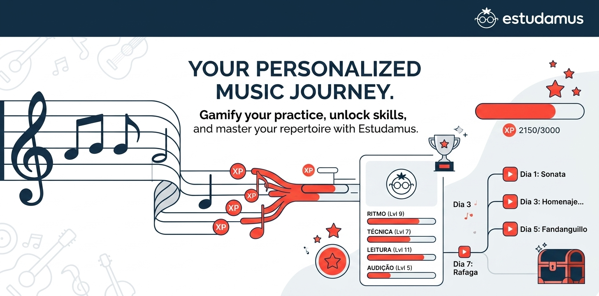
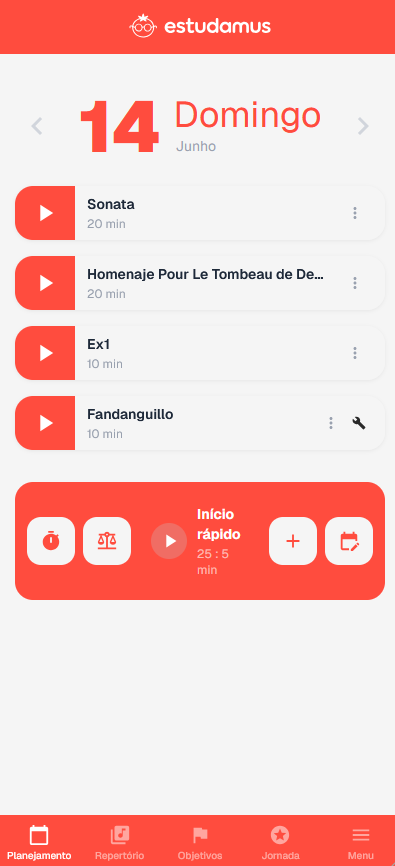
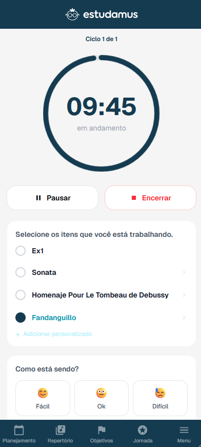
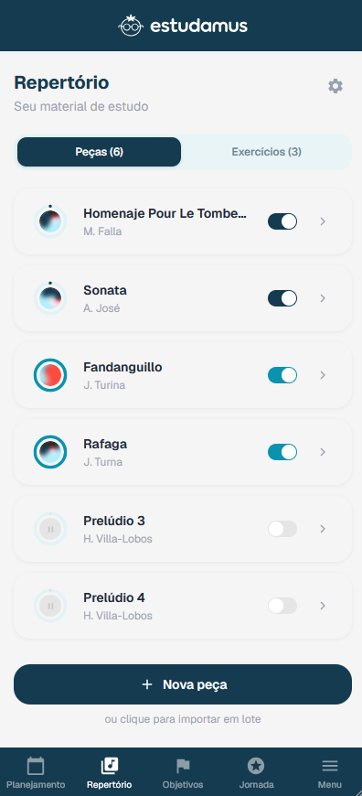
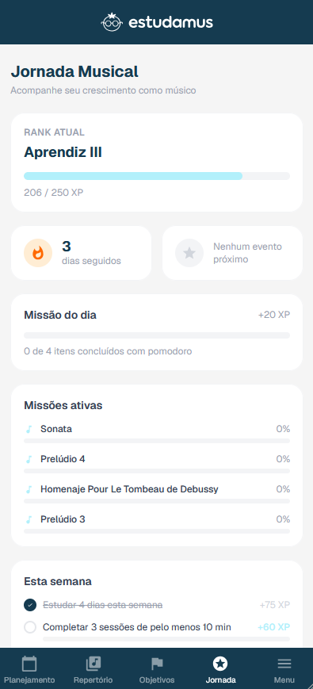
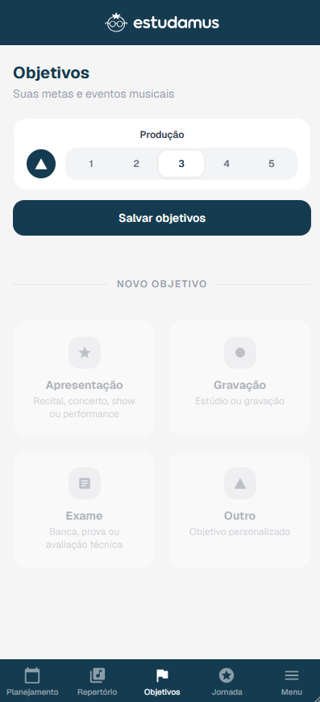
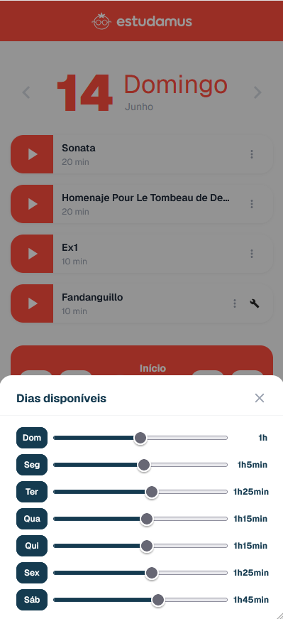

# estudamus 🎵



Plataforma web de gestão pedagógica musical para professores e alunos — planejamento de estudo semanal gerado por algoritmo próprio e gamificação completa por atributo musical.

**Live:** [estudamus.vercel.app](https://estudamus.vercel.app/)

## O que é

O **estudamus** organiza o fluxo pedagógico de música em torno de dois perfis:

- **Professor** — gerencia alunos, repertório (peças e exercícios), programas (concertos, recitais, exames) e planejamento de estudos.
- **Aluno** — acompanha as tarefas do dia, cronometra o estudo com pomodoro, consulta repertório e histórico, e evolui em um sistema de gamificação.

Em produção, com usuários reais, como produto gratuito.

## Funcionalidades

- **Planejamento automático** — algoritmo próprio distribui tarefas por dia com base em disponibilidade do aluno, dificuldade, percentual de conclusão e proximidade de prazo de programas.
- **Pomodoro configurável** — ciclos clássico/longo/curto/livre, com registro de sessões de estudo.
- **Gamificação completa** — XP por atributo musical (técnica, leitura, ritmo, musicalidade, performance, percepção, improvisação, teoria, história), 22 ranks progressivos (Aprendiz → Mestre), missões diárias/semanais e uma aba "Jornada" com leaderboard, tanto para aluno quanto professor.
- **Repertório e programas** — peças e exercícios com checklist de progresso, vinculados a programas (concertos, recitais, shows, exames) com prazos e prioridades.
- **Onboarding guiado** — tour de configuração inicial (disponibilidade semanal e repertório) na primeira entrada.
- **Landing page pública** com apresentação do produto antes do login.

Detalhes de arquitetura, algoritmo de planejamento e sistema de gamificação em [`docs/architecture.md`](docs/architecture.md).

## Stack

- [React 19](https://react.dev) + [Vite](https://vitejs.dev) + [TypeScript](https://www.typescriptlang.org)
- [React Router v7](https://reactrouter.com)
- [Tailwind CSS v4](https://tailwindcss.com) + [shadcn/ui](https://ui.shadcn.com) (preset `radix-nova`, primitivas [Radix UI](https://www.radix-ui.com))
- [Supabase](https://supabase.com) — Auth (e-mail/senha + Google OAuth), PostgreSQL com Row Level Security, Storage
- [dnd-kit](https://dndkit.com) (drag & drop), [Recharts](https://recharts.org) (gráficos), [Motion](https://motion.dev) (animações), [nextstepjs](https://nextstepjs.com) (onboarding), [Sonner](https://sonner.emilkowal.ski) (toasts), [boring-avatars](https://boringavatars.com) (avatares), `canvas-confetti` (reforço positivo de gamificação)
- [Sentry](https://sentry.io) (erros), [Microsoft Clarity](https://clarity.microsoft.com) + Google Analytics (analytics)
- Deploy na [Vercel](https://vercel.com)

## Rodando localmente

```bash
# Instalar dependências
npm install

# Rodar em desenvolvimento
npm run dev

# Build de produção
npm run build

# Lint
npm run lint

# Preview do build
npm run preview
```

Copie `.env.example` para `.env.local` e preencha as variáveis (ver arquivo para detalhes de cada uma):

```bash
cp .env.example .env.local
```

## Screenshots

| | |
|---|---|
| **Planejamento automático**<br> | **Pomodoro**<br> |
| **Repertório**<br> | **Gamificação**<br> |
| **Objetivos**<br> | **Disponibilidade**<br> |

## Licença

Privado — todos os direitos reservados.
